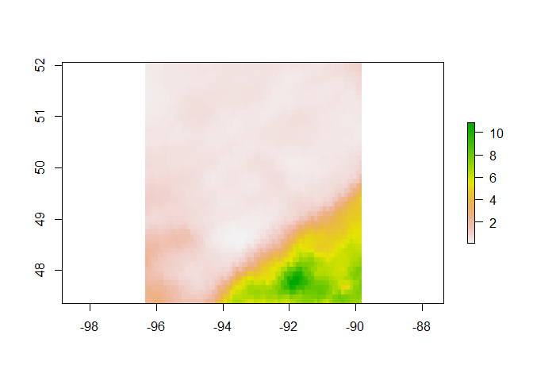

<!-- README.md is generated from README.Rmd. Please edit that file -->

**Work in progress, contributions/input welcome**

# mscgeometR

R wrapper for querying the Meteorological Service of Canada’s (MSC)
[GeoMet
webservices](https://eccc-msc.github.io/open-data/msc-geomet/web-services_en).

Includes functionality for querying both the [GeoMet Web Coverage
Service
(WCS)](https://geo.weather.gc.ca/geomet?lang=en&service=WCS&version=2.0.1&request=GetCapabilities)
as well as the [OGC OpenAPI
endpoint](https://api.weather.gc.ca/openapi).

For more information on both services, please see the [official
documentation](https://eccc-msc.github.io/open-data/msc-geomet/web-services_en).

## Installation

`mscgeometR` is not available on CRAN, you can install it from GitHub
using `remotes`

``` r
remotes::install_github("rywhale/mscgeometR")
```

## WCS Data

Queries to the WCS endpoint require you to know the coverage ID of the
layer you’re after. You can get a full list of these IDs with
`geomet_wcs_capabilities()`

Setting the query parameters requires some familiarity with the product
specification (e.g. resolution). Generally, specifying no “TIME” in the
query will lead to the most recent product being returned.

Once you have the coverage ID, you can query data like so

``` r
library(raster)
#> Warning: package 'raster' was built under R version 4.1.3
#> Loading required package: sp
#> Warning: package 'sp' was built under R version 4.1.3

# Downloads to temporary .tif file
rdpa_file <- geomet_wcs_data(
  # Regional Deterministic Precipitation Analysis
  coverage_id = "RDPA.24F_PR",
  # Set query parameters
  query = list(
    "SUBSETTINGCRS" = "EPSG:4326",
    "OUTPUTCRS" = "EPSG:4326",
    # Res
    "RESOLUTION" = "x(0.09)",
    "RESOLUTION" = "y(0.09)",
    # Bounding box
    "SUBSET" = "x(-96.3553, -89.8336)",
    "SUBSET" = "y(47.3633, 52.0529)",
    "TIME" = paste0(Sys.Date() - 1, "T12:00:00Z")
  )
)

rdpa_rast <- raster(rdpa_file)
raster::crs(rdpa_rast) <- raster::crs("EPSG:4326")

plot(rdpa_rast)
```



`geomet_wcs_data()` downloads the query result to a GeoTIFF file in a
temporary directory. Restarting your R session will clear these
temporary files.

## OGC API Data

You can get a full list of the collections available with

``` r
geomet_api_collections()
#> # A tibble: 72 x 2
#>    collection                                                   collection_id   
#>    <chr>                                                        <chr>           
#>  1 Hydrometric Monitoring Stations                              hydrometric-sta~
#>  2 Daily Mean of Water Level or Flow                            hydrometric-dai~
#>  3 Monthly Mean of Water Level or Flow                          hydrometric-mon~
#>  4 Annual Maximum and Minimum Daily Water Level or Flow         hydrometric-ann~
#>  5 Annual Maximum and Minimum Instantaneous Water Level or Flow hydrometric-ann~
#>  6 Real-time hydrometric data                                   hydrometric-rea~
#>  7 1981-2010 Climate Normals                                    climate-normals 
#>  8 Climate Stations                                             climate-stations
#>  9 Monthly Climate Observation Summaries                        climate-monthly 
#> 10 Daily Climate Observations                                   climate-daily   
#> # ... with 62 more rows
```

The `collection_id` values in the above table can then be used to list
potential query parameters for each collection, e.g. for hydrometric
stations

``` r
geomet_api_queryables("hydrometric-stations")
#> # A tibble: 9 x 2
#>   queryable           type  
#>   <chr>               <chr> 
#> 1 CONTRIBUTOR_EN      string
#> 2 CONTRIBUTOR_FR      string
#> 3 IDENTIFIER          string
#> 4 PROV_TERR_STATE_LOC string
#> 5 STATION_NAME        string
#> 6 STATION_NUMBER      string
#> 7 STATUS_EN           string
#> 8 STATUS_FR           string
#> 9 VERTICAL_DATUM      string
```

Note that boolean variables should be quoted, e.g. `FALSE` -> `"false"`

### Adjusted Homogenized Canadian Climate Data (AHCCD)

``` r
# View available stations
head(geomet_ahccd_stns())
#>   identifier__identifiant station_id__id_station station_name__nom_station
#> 1                 1123993                1123993       KELOWNA QUAILS GATE
#> 2                 1114627                1114627      LILLOOET SETON BCHPA
#> 3                 1164730                1164730          LUMBY SIGALET RD
#> 4                 1114745                1114745                    LYTTON
#> 5                 1054920                1054920            MASSET AIRPORT
#> 6                 10253G0                10253G0         NANAIMO CITY YARD
#>   measurement_type__type_mesure period__periode trend_value__valeur_tendance
#> 1                          snow             Ann                           NA
#> 2                          snow             Ann                           NA
#> 3                          snow             Ann                           NA
#> 4                          snow             Ann                           NA
#> 5                          snow             Ann                           NA
#> 6                          snow             Ann                           NA
#>   elevation__elevation province__province joined__rejoint year_range__annees
#> 1                  417                 BC               1               <NA>
#> 2                  198                 BC               1               <NA>
#> 3                  560                 BC               1               <NA>
#> 4                  174                 BC               1               <NA>
#> 5                    7                 BC               1               <NA>
#> 6                  114                 BC               1               <NA>
#>   start_date__date_debut end_date__date_fin        coordinates
#> 1             2014-04-01         2014-04-01 -119.5728, 49.8422
#> 2             2001-04-01         2001-04-01 -121.9242, 50.6733
#> 3             1999-02-01         1999-02-01 -118.7667, 50.3667
#> 4             2015-06-01         2015-06-01 -121.6078, 50.2569
#> 5             2008-06-01         2008-06-01 -132.1175, 54.0226
#> 6             2017-12-01         2017-12-01 -123.9878, 49.1989

# Example query
ahccd_dat <- geomet_ahccd_data(
  station_number = "3011120", 
  period = "year"
  )

head(ahccd_dat)
#>   lat__lat lon__long identifier__identifiant station_id__id_station
#> 1     53.2    -113.8            3011120.2002                3011120
#> 2     53.2    -113.8            3011120.2001                3011120
#> 3     53.2    -113.8            3011120.1942                3011120
#> 4     53.2    -113.8            3011120.1956                3011120
#> 5     53.2    -113.8            3011120.1917                3011120
#> 6     53.2    -113.8            3011120.1933                3011120
#>   period_group__groupe_periode period_value__valeur_periode province__province
#> 1                       Annual                          Ann                 AB
#> 2                       Annual                          Ann                 AB
#> 3                       Annual                          Ann                 AB
#> 4                       Annual                          Ann                 AB
#> 5                       Annual                          Ann                 AB
#> 6                       Annual                          Ann                 AB
#>   year__annee temp_mean__temp_moyenne temp_mean_units__temp_moyenne_unites
#> 1        2002                     3.1                                    C
#> 2        2001                 -9999.9                                    C
#> 3        1942                     2.5                                    C
#> 4        1956                     1.6                                    C
#> 5        1917                 -9999.9                                    C
#> 6        1933                     0.6                                    C
#>   temp_min__temp_min temp_min_units__temp_min_unites temp_max__temp_max
#> 1               -3.5                               C                9.6
#> 2            -9999.9                               C            -9999.9
#> 3               -4.6                               C                9.5
#> 4               -4.8                               C                8.1
#> 5            -9999.9                               C            -9999.9
#> 6               -6.2                               C                7.4
#>   temp_max_units__temp_max_unites total_precip__precip_totale
#> 1                               C                       388.2
#> 2                               C                     -9999.9
#> 3                               C                       719.6
#> 4                               C                       544.8
#> 5                               C                     -9999.9
#> 6                               C                       621.1
#>   total_precip_units__precip_totale_unites rain__pluie rain_units__pluie_unites
#> 1                                       mm       194.5                       mm
#> 2                                       mm     -9999.9                       mm
#> 3                                       mm       494.1                       mm
#> 4                                       mm       388.0                       mm
#> 5                                       mm     -9999.9                       mm
#> 6                                       mm       421.9                       mm
#>   snow__neige snow_units__neige_unites pressure_sea_level__pression_niveau_mer
#> 1       193.7                       mm                                      NA
#> 2     -9999.9                       mm                                      NA
#> 3       225.5                       mm                                      NA
#> 4       156.8                       mm                                      NA
#> 5     -9999.9                       mm                                      NA
#> 6       199.2                       mm                                      NA
#>   pressure_sea_level_units__pression_niveau_mer_unite
#> 1                                                 hPa
#> 2                                                 hPa
#> 3                                                 hPa
#> 4                                                 hPa
#> 5                                                 hPa
#> 6                                                 hPa
#>   pressure_station__pression_station
#> 1                                 NA
#> 2                                 NA
#> 3                                 NA
#> 4                                 NA
#> 5                                 NA
#> 6                                 NA
#>   pressure_station_units__pression_station_unites wind_speed__vitesse_vent
#> 1                                             hPa                       NA
#> 2                                             hPa                       NA
#> 3                                             hPa                       NA
#> 4                                             hPa                       NA
#> 5                                             hPa                       NA
#> 6                                             hPa                       NA
#>   wind_speed_units__vitesse_vent_unites  coordinates
#> 1                                   kph -113.8, 53.2
#> 2                                   kph -113.8, 53.2
#> 3                                   kph -113.8, 53.2
#> 4                                   kph -113.8, 53.2
#> 5                                   kph -113.8, 53.2
#> 6                                   kph -113.8, 53.2
```

### Climate Station Data

``` r
# View available stations
clim_stns <- geomet_clim_stns()

# Lots of columns, here are the first few
head(clim_stns[, 1:5])
#>   STN_ID      STATION_NAME PROV_STATE_TERR_CODE ENG_PROV_NAME FRE_PROV_NAME
#> 1   2233          COWLEY A                   AB       ALBERTA       ALBERTA
#> 2   2241     FOREMOST EAST                   AB       ALBERTA       ALBERTA
#> 3   2252              HAYS                   AB       ALBERTA       ALBERTA
#> 4   2254    HERRONTON EAST                   AB       ALBERTA       ALBERTA
#> 5   2264 LETHBRIDGE BEGAMY                   AB       ALBERTA       ALBERTA
#> 6   2268            LOMOND                   AB       ALBERTA       ALBERTA

# Example query
clim_data <- geomet_clim_means(
  station_number = "1126070",
  start_date = "2016-01-01",
  end_date = "2016-01-02"
)

head(clim_data)
#>   STATION_NAME CLIMATE_IDENTIFIER               ID          LOCAL_DATE
#> 1    PEACHLAND            1126070 1126070.2016.1.1 2016-01-01 00:00:00
#> 2    PEACHLAND            1126070 1126070.2016.1.2 2016-01-02 00:00:00
#>   PROVINCE_CODE LOCAL_YEAR LOCAL_MONTH LOCAL_DAY MEAN_TEMPERATURE
#> 1            BC       2016           1         1             -6.3
#> 2            BC       2016           1         2             -7.8
#>   MEAN_TEMPERATURE_FLAG MIN_TEMPERATURE MIN_TEMPERATURE_FLAG MAX_TEMPERATURE
#> 1                    NA            -7.0                   NA            -5.5
#> 2                    NA            -9.5                   NA            -6.0
#>   MAX_TEMPERATURE_FLAG TOTAL_PRECIPITATION TOTAL_PRECIPITATION_FLAG TOTAL_RAIN
#> 1                   NA                   0                       NA          0
#> 2                   NA                   0                       NA          0
#>   TOTAL_RAIN_FLAG TOTAL_SNOW TOTAL_SNOW_FLAG SNOW_ON_GROUND SNOW_ON_GROUND_FLAG
#> 1              NA          0              NA             28                  NA
#> 2              NA          0              NA             27                  NA
#>   DIRECTION_MAX_GUST DIRECTION_MAX_GUST_FLAG SPEED_MAX_GUST SPEED_MAX_GUST_FLAG
#> 1                 NA                      NA             NA                  NA
#> 2                 NA                      NA             NA                  NA
#>   COOLING_DEGREE_DAYS COOLING_DEGREE_DAYS_FLAG HEATING_DEGREE_DAYS
#> 1                   0                       NA                24.3
#> 2                   0                       NA                25.8
#>   HEATING_DEGREE_DAYS_FLAG MIN_REL_HUMIDITY MIN_REL_HUMIDITY_FLAG
#> 1                       NA               NA                    NA
#> 2                       NA               NA                    NA
#>   MAX_REL_HUMIDITY MAX_REL_HUMIDITY_FLAG          coordinates
#> 1               NA                    NA -119.71667, 49.78333
#> 2               NA                    NA -119.71667, 49.78333

# Normals
clim_normals <- geomet_clim_normals(station_number = "1126070")

head(clim_normals)
#>   STATION_NAME CLIMATE_IDENTIFIER         ID PERIOD CURRENT_FLAG NORMAL_CODE
#> 1    PEACHLAND            1126070  1046.24.8   NORM            Y           C
#> 2    PEACHLAND            1126070  1046.24.9   NORM            Y           C
#> 3    PEACHLAND            1126070 1046.24.10   NORM            Y           D
#> 4    PEACHLAND            1126070 1046.24.11   NORM            Y           C
#> 5    PEACHLAND            1126070 1046.24.12   NORM            Y           C
#> 6    PEACHLAND            1126070 1046.24.13   NORM            Y           D
#>   NORMAL_ID PUBLICATION_CODE     DATE_CALCULATED FIRST_OCCURRENCE_DATE
#> 1        24                1 2012-10-10 14:40:42                  <NA>
#> 2        24                1 2012-10-10 14:40:42                  <NA>
#> 3        24                1 2012-10-10 14:40:42                  <NA>
#> 4        24                1 2012-10-10 14:40:42                  <NA>
#> 5        24                1 2012-10-10 14:40:42                  <NA>
#> 6        24                1 2012-10-10 14:40:42                  <NA>
#>   PROVINCE_CODE PERIOD_BEGIN PERIOD_END FIRST_YEAR FIRST_YEAR_NORMAL_PERIOD
#> 1            BC         1981       2010         NA                     1983
#> 2            BC         1981       2010         NA                     1983
#> 3            BC         1981       2010         NA                     1983
#> 4            BC         1981       2010         NA                     1983
#> 5            BC         1981       2010         NA                     1982
#> 6            BC         1981       2010         NA                     1982
#>   LAST_YEAR LAST_YEAR_NORMAL_PERIOD YEAR_COUNT_NORMAL_PERIOD TOTAL_OBS_COUNT
#> 1        NA                    2006                       21             651
#> 2        NA                    2006                       20             600
#> 3        NA                    2006                       18             558
#> 4        NA                    2006                       20             600
#> 5        NA                    2006                       20             620
#> 6        NA                    2007                       22            7334
#>   OCCURRENCE_COUNT MAX_DURATION_MISSING_YEARS PERCENT_OF_POSSIBLE_OBS
#> 1               NA                          2                   95.45
#> 2               NA                          1                   90.91
#> 3               NA                          2                   81.82
#> 4               NA                          1                   86.96
#> 5               NA                          2                   86.96
#> 6               NA                          2                   89.96
#>              E_NORMAL_ELEMENT_NAME
#> 1 Total degree-days Above 15 deg C
#> 2 Total degree-days Above 15 deg C
#> 3 Total degree-days Above 15 deg C
#> 4 Total degree-days Above 15 deg C
#> 5 Total degree-days Above 15 deg C
#> 6 Total degree-days Above 15 deg C
#>                             F_NORMAL_ELEMENT_NAME MONTH  VALUE
#> 1 Total des degrés-jours supérieurs à 15 degree C     8 183.19
#> 2 Total des degrés-jours supérieurs à 15 degree C     9  52.62
#> 3 Total des degrés-jours supérieurs à 15 degree C    10   1.99
#> 4 Total des degrés-jours supérieurs à 15 degree C    11   0.00
#> 5 Total des degrés-jours supérieurs à 15 degree C    12   0.00
#> 6 Total des degrés-jours supérieurs à 15 degree C    13 578.55
#>            coordinates
#> 1 -119.71667, 49.78333
#> 2 -119.71667, 49.78333
#> 3 -119.71667, 49.78333
#> 4 -119.71667, 49.78333
#> 5 -119.71667, 49.78333
#> 6 -119.71667, 49.78333
```

### Hydrometric Station Data

``` r
# View available Ontario stations
hydro_stns <- geomet_hydro_stns(
  query = list(
    "PROV_TERR_STATE_LOC" = "ON"
    )
  )

head(hydro_stns)
#>                                STATION_NAME IDENTIFIER STATION_NUMBER
#> 1                    PINE RIVER NEAR CROOKS    02AA002        02AA002
#> 2             KAMINISTIQUIA RIVER NEAR DONA    02AB001        02AB001
#> 3      SHEBANDOWAN RIVER NEAR KAMINISTIQUIA    02AB002        02AB002
#> 4            KAMINISTIQUIA RIVER AT MOKOMON    02AB003        02AB003
#> 5 KAMINISTIQUIA RIVER AT OUTLET OF DOG LAKE    02AB004        02AB004
#> 6            SHEBANDOWAN RIVER AT GLENWATER    02AB005        02AB005
#>   PROV_TERR_STATE_LOC    STATUS_EN STATUS_FR           CONTRIBUTOR_EN
#> 1                  ON Discontinued    Fermée                         
#> 2                  ON Discontinued    Fermée                         
#> 3                  ON Discontinued    Fermée                         
#> 4                  ON Discontinued    Fermée                         
#> 5                  ON Discontinued    Fermée ONTARIO POWER GENERATION
#> 6                  ON Discontinued    Fermée                         
#>                     CONTRIBUTOR_FR                  VERTICAL_DATUM
#> 1                                                    ASSUMED DATUM
#> 2                                                                 
#> 3                                                                 
#> 4                                  GEODETIC SURVEY OF CANADA DATUM
#> 5 SOCIÉTÉ ONTARIO POWER GENERATION                                
#> 6                                                                 
#>           coordinates
#> 1 -89.53333, 48.07222
#> 2 -89.58861, 48.55556
#> 3 -89.62361, 48.54583
#> 4 -89.60000, 48.49167
#> 5 -89.63333, 48.70833
#> 6 -89.78333, 48.54333

# Example means query
hydro_dat <- geomet_hydro_means(
  station_number = "04HA001",
  start_date = "2016-01-01",
  end_date = "2016-01-02"
)

head(hydro_dat)
#>           IDENTIFIER                 STATION_NAME STATION_NUMBER
#> 1 04HA001.2016-01-01 ALBANY RIVER NEAR HAT ISLAND        04HA001
#> 2 04HA001.2016-01-02 ALBANY RIVER NEAR HAT ISLAND        04HA001
#>   PROV_TERR_STATE_LOC       DATE LEVEL DISCHARGE DISCHARGE_SYMBOL_EN
#> 1                  ON 2016-01-01 3.543       412      Ice Conditions
#> 2                  ON 2016-01-02    NA       406      Ice Conditions
#>   DISCHARGE_SYMBOL_FR LEVEL_SYMBOL_EN    LEVEL_SYMBOL_FR         coordinates
#> 1  Conditions à glace     Partial Day Journée incomplète -83.83333, 51.33056
#> 2  Conditions à glace            <NA>               <NA> -83.83333, 51.33056

# Real time query
hydro_rt <- geomet_hydro_realtime(station_number = "04HA001")

head(hydro_rt)
#>                    IDENTIFIER STATION_NUMBER                 STATION_NAME
#> 1 04HA001.2022-12-21.00:45:00        04HA001 ALBANY RIVER NEAR HAT ISLAND
#> 2 04HA001.2022-12-21.00:50:00        04HA001 ALBANY RIVER NEAR HAT ISLAND
#> 3 04HA001.2022-12-21.00:55:00        04HA001 ALBANY RIVER NEAR HAT ISLAND
#> 4 04HA001.2022-12-21.01:00:00        04HA001 ALBANY RIVER NEAR HAT ISLAND
#> 5 04HA001.2022-12-21.01:05:00        04HA001 ALBANY RIVER NEAR HAT ISLAND
#> 6 04HA001.2022-12-21.01:10:00        04HA001 ALBANY RIVER NEAR HAT ISLAND
#>   PROV_TERR_STATE_LOC            DATETIME              DATETIME_LST LEVEL
#> 1                  ON 2022-12-21T00:45:00 2022-12-20T19:45:00-05:00 2.978
#> 2                  ON 2022-12-21T00:50:00 2022-12-20T19:50:00-05:00 2.978
#> 3                  ON 2022-12-21T00:55:00 2022-12-20T19:55:00-05:00 2.978
#> 4                  ON 2022-12-21T01:00:00 2022-12-20T20:00:00-05:00 2.978
#> 5                  ON 2022-12-21T01:05:00 2022-12-20T20:05:00-05:00 2.978
#> 6                  ON 2022-12-21T01:10:00 2022-12-20T20:10:00-05:00 2.979
#>   DISCHARGE LEVEL_SYMBOL_EN LEVEL_SYMBOL_FR DISCHARGE_SYMBOL_EN
#> 1      1110              NA              NA                  NA
#> 2      1110              NA              NA                  NA
#> 3      1110              NA              NA                  NA
#> 4      1110              NA              NA                  NA
#> 5      1110              NA              NA                  NA
#> 6      1110              NA              NA                  NA
#>   DISCHARGE_SYMBOL_FR         coordinates
#> 1                  NA -83.83333, 51.33056
#> 2                  NA -83.83333, 51.33056
#> 3                  NA -83.83333, 51.33056
#> 4                  NA -83.83333, 51.33056
#> 5                  NA -83.83333, 51.33056
#> 6                  NA -83.83333, 51.33056
```

### Long Term Climate Extremes (LTCE)

``` r
# View available stations in Ontario
ltce_stns <- geomet_ltce_stns(
  query = list(
    "PROVINCE_CODE" = "ON"
  )
)

head(ltce_stns)
#>   VIRTUAL_CLIMATE_ID VIRTUAL_STATION_NAME_E VIRTUAL_STATION_NAME_F
#> 1            VSON74V        KEMPTVILLE AREA             KEMPTVILLE
#> 2            VSON98V        ST. THOMAS AREA             ST. THOMAS
#> 3            VSON98V        ST. THOMAS AREA             ST. THOMAS
#> 4            VSON16V         WALKERTON AREA              WALKERTON
#> 5            VSON16V         WALKERTON AREA              WALKERTON
#> 6            VSON16V         WALKERTON AREA              WALKERTON
#>   WXO_CITY_CODE            ELEMENT_NAME_E CLIMATE_IDENTIFIER
#> 1         ON-74 DAILY MAXIMUM TEMPERATURE            6104027
#> 2         ON-98 DAILY TOTAL PRECIPITATION            6144478
#> 3         ON-98 DAILY TOTAL PRECIPITATION            6137362
#> 4         ON-16 DAILY TOTAL PRECIPITATION            6145504
#> 5         ON-16 DAILY TOTAL PRECIPITATION            6113329
#> 6         ON-16 DAILY TOTAL PRECIPITATION            6113329
#>             START_DATE             END_DATE DATA_SOURCE       ENG_STN_NAME
#> 1 2007-01-01T00:00:00Z                 <NA>       DLY02      KEMPTVILLE CS
#> 2 2007-01-01T00:00:00Z                 <NA>       DLY02          LONDON CS
#> 3 1980-05-01T00:00:00Z 2006-12-31T00:00:00Z       DLY04     ST THOMAS WPCP
#> 4 2008-10-01T00:00:00Z                 <NA>       DLY02 MOUNT FOREST (AUT)
#> 5 2007-01-01T00:00:00Z 2008-09-30T00:00:00Z       DLY44            HANOVER
#> 6 1972-01-01T00:00:00Z 2006-12-31T00:00:00Z       DLY04            HANOVER
#>   FRE_STN_NAME PROVINCE_CODE
#> 1         <NA>            ON
#> 2         <NA>            ON
#> 3         <NA>            ON
#> 4         <NA>            ON
#> 5         <NA>            ON
#> 6         <NA>            ON
#>                                                                            IDENTIFIER
#> 1                 vson74v-daily-maximum-temperature-6104027-2007-01-01t00-00-00z-none
#> 2                 vson98v-daily-total-precipitation-6144478-2007-01-01t00-00-00z-none
#> 3 vson98v-daily-total-precipitation-6137362-1980-05-01t00-00-00z-2006-12-31t00-00-00z
#> 4                 vson16v-daily-total-precipitation-6145504-2008-10-01t00-00-00z-none
#> 5 vson16v-daily-total-precipitation-6113329-2007-01-01t00-00-00z-2008-09-30t00-00-00z
#> 6 vson16v-daily-total-precipitation-6113329-1972-01-01t00-00-00z-2006-12-31t00-00-00z
#>     coordinates
#> 1 -75.64, 45.02
#> 2 -81.19, 42.78
#> 3 -81.19, 42.78
#> 4 -81.15, 44.13
#> 5 -81.15, 44.13
#> 6 -81.15, 44.13

# Example query
ltce_dat <- geomet_ltce_data(
  station_number = "VSON99V",
  param = "temp"
)

# Lots of columns, here are the first few
head(ltce_dat[, 1:5])
#>   WXO_CITY_CODE VIRTUAL_STATION_NAME_E VIRTUAL_STATION_NAME_F
#> 1         ON-99         PEAWANUCK AREA              PEAWANUCK
#> 2         ON-99         PEAWANUCK AREA              PEAWANUCK
#> 3         ON-99         PEAWANUCK AREA              PEAWANUCK
#> 4         ON-99         PEAWANUCK AREA              PEAWANUCK
#> 5         ON-99         PEAWANUCK AREA              PEAWANUCK
#> 6         ON-99         PEAWANUCK AREA              PEAWANUCK
#>   VIRTUAL_CLIMATE_ID LOCAL_MONTH
#> 1            VSON99V           1
#> 2            VSON99V           1
#> 3            VSON99V           1
#> 4            VSON99V           1
#> 5            VSON99V           1
#> 6            VSON99V           1
```

### Surface Weather Observations (SWOB)

``` r
swob_dat <- geomet_swob_realtime(
  station_number = "1192948",
  start_date = Sys.Date(),
  end_date = Sys.Date(),
  query = list(
    "_is-minutely_obs-value" = "false"
  )
)

# Lots of columns, here are the first few
head(swob_dat[, 1:5])
#>                                                    dataset
#> 1 msc-observation-atmospheric-surface_weather-ca-1.1-ascii
#> 2 msc-observation-atmospheric-surface_weather-ca-1.1-ascii
#> 3 msc-observation-atmospheric-surface_weather-ca-1.1-ascii
#> 4 msc-observation-atmospheric-surface_weather-ca-1.1-ascii
#> 5 msc-observation-atmospheric-surface_weather-ca-1.1-ascii
#> 6 msc-observation-atmospheric-surface_weather-ca-1.1-ascii
#>                                   id
#> 1 2023-01-19-0200-CVFN-AUTO-swob.xml
#> 2 2023-01-19-0300-CVFN-AUTO-swob.xml
#> 3 2023-01-19-0000-CVFN-AUTO-swob.xml
#> 4 2023-01-19-0100-CVFN-AUTO-swob.xml
#> 5 2023-01-19-0400-CVFN-AUTO-swob.xml
#> 6 2023-01-19-1100-CVFN-AUTO-swob.xml
#>                                                                                               url
#> 1 https://dd.weather.gc.ca//observations/swob-ml/20230119/CVFN/2023-01-19-0200-CVFN-AUTO-swob.xml
#> 2 https://dd.weather.gc.ca//observations/swob-ml/20230119/CVFN/2023-01-19-0300-CVFN-AUTO-swob.xml
#> 3 https://dd.weather.gc.ca//observations/swob-ml/20230119/CVFN/2023-01-19-0000-CVFN-AUTO-swob.xml
#> 4 https://dd.weather.gc.ca//observations/swob-ml/20230119/CVFN/2023-01-19-0100-CVFN-AUTO-swob.xml
#> 5 https://dd.weather.gc.ca//observations/swob-ml/20230119/CVFN/2023-01-19-0400-CVFN-AUTO-swob.xml
#> 6 https://dd.weather.gc.ca//observations/swob-ml/20230119/CVFN/2023-01-19-1100-CVFN-AUTO-swob.xml
#>   date_tm-uom            date_tm-value
#> 1    datetime 2023-01-19T02:00:00.000Z
#> 2    datetime 2023-01-19T03:00:00.000Z
#> 3    datetime 2023-01-19T00:00:00.000Z
#> 4    datetime 2023-01-19T01:00:00.000Z
#> 5    datetime 2023-01-19T04:00:00.000Z
#> 6    datetime 2023-01-19T11:00:00.000Z
```

## Contributing

If you see data sets missing or come across any problems, please [submit
an issue](https://github.com/rywhale/mscgeometR/issues).

See
[here](https://github.com/rywhale/mscgeometR/blob/main/.github/CONTRIBUTING.md)
for general contribution guidelines.
