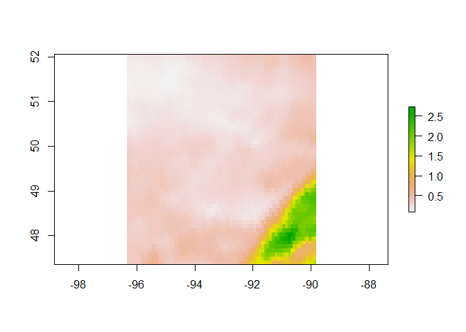

<!-- README.md is generated from README.Rmd. Please edit that file -->

**Work in progress, breaking changes are possible! Contributions/input
welcome**

# mscgeometR

<!-- badges: start -->

[](https://github.com/rywhale/mscgeometR/actions/workflows/check-standard.yaml)
[](https://opensource.org/licenses/MIT)
<!-- badges: end -->

R wrapper for querying the Meteorological Service of Canada’s (MSC)
[GeoMet
webservices](https://eccc-msc.github.io/open-data/msc-geomet/readme_en/).

Includes functionality for querying both the [GeoMet Web Coverage
Service
(WCS)](https://geo.weather.gc.ca/geomet?lang=en&service=WCS&version=2.0.1&request=GetCapabilities)
as well as the [OGC OpenAPI
endpoint](https://api.weather.gc.ca/openapi).

For more information on both services, please see the [official
documentation](https://eccc-msc.github.io/open-data/msc-geomet/readme_en/).

## Installation

`mscgeometR` is not available on CRAN, you can install it from GitHub
using `remotes`

``` r
remotes::install_github("rywhale/mscgeometR")
```

## WCS Data

Queries to the WCS endpoint require you to know the coverage ID of the
layer you’re after. You can get a full list of these IDs with
`geomet_wcs_capabilities()`

Setting the query parameters requires some familiarity with the product
specification (e.g. resolution). Generally, specifying no `TIME` in the
query will lead to the most recent product being returned.

*NOTE: Per the documentation, if no resolution is set in these queries
the data may be returned in an incorrect resolution so you should always
set it*

Once you have the coverage ID, you can query data like so

``` r
library(terra)
#> terra 1.8.42
#> 
#> Attaching package: 'terra'
#> The following objects are masked from 'package:testthat':
#> 
#>     compare, describe

# Downloads to temporary .tif file
rdpa_file <- geomet_wcs_data(
  # Regional Deterministic Precipitation Analysis
  coverage_id = "RDPA.24F_PR",
  # Set query parameters
  query = list(
    "SUBSETTINGCRS" = "EPSG:4326",
    "OUTPUTCRS" = "EPSG:4326",
    # Resolution
    "RESOLUTION" = "x(0.09)",
    "RESOLUTION" = "y(0.09)",
    # Bounding box
    "SUBSET" = "x(-96.3553, -89.8336)",
    "SUBSET" = "y(47.3633, 52.0529)",
    "TIME" = paste0(Sys.Date() - 1, "T12:00:00Z")
  )
)

rdpa_rast <- rast(rdpa_file)
crs(rdpa_rast) <- crs("EPSG:4326")

plot(rdpa_rast)
```



`geomet_wcs_data()` downloads the query result to a GeoTIFF file in a
temporary directory. Restarting your R session will clear these
temporary files.

## OGC API Data

You can get a full list of the collections available with

``` r
geomet_api_collections()
#> # A tibble: 100 × 2
#>    collection                                                      collection_id
#>    <chr>                                                           <chr>        
#>  1 Hydrometric Data - Monitoring Stations                          hydrometric-…
#>  2 Hydrometric Historical Data (HYDAT) - Daily Mean of Water Leve… hydrometric-…
#>  3 Hydrometric Historical Data (HYDAT) - Monthly Mean of Water Le… hydrometric-…
#>  4 Hydrometric Historical Data (HYDAT) - Annual Maximum and Minim… hydrometric-…
#>  5 Hydrometric Historical Data (HYDAT) - Annual Maximum and Minim… hydrometric-…
#>  6 Hydrometric Data - Real-time                                    hydrometric-…
#>  7 Climate - Normals 1981-2010                                     climate-norm…
#>  8 Climate - Stations                                              climate-stat…
#>  9 Climate - Monthly Observation Summaries                         climate-mont…
#> 10 City Page Weather [experimental]                                citypageweat…
#> # ℹ 90 more rows
```

The `collection_id` values in the above table can then be used to list
potential query parameters for each collection, e.g. for hydrometric
stations

``` r
geomet_api_queryables("hydrometric-stations")
#> # A tibble: 13 × 2
#>    queryable            type  
#>    <chr>                <chr> 
#>  1 CONTRIBUTOR_EN       string
#>  2 CONTRIBUTOR_FR       string
#>  3 DRAINAGE_AREA_EFFECT number
#>  4 DRAINAGE_AREA_GROSS  number
#>  5 IDENTIFIER           string
#>  6 PROV_TERR_STATE_LOC  string
#>  7 REAL_TIME            byte  
#>  8 RHBN                 byte  
#>  9 STATION_NAME         string
#> 10 STATION_NUMBER       string
#> 11 STATUS_EN            string
#> 12 STATUS_FR            string
#> 13 VERTICAL_DATUM       string
```

Note that boolean variables should be quoted, e.g. `FALSE` -\> `"false"`

### Adjusted Homogenized Canadian Climate Data (AHCCD)

``` r
# View available stations
head(geomet_ahccd_stns())
#>   identifier__identifiant station_id__id_station
#> 1                 1171020                1171020
#> 2                 1101200                1101200
#> 3                 1191440                1191440
#> 4                 116146F                116146F
#> 5                 1142160                1142160
#> 6                 1142400                1142400
#>          station_name__nom_station measurement_type__type_mesure
#> 1                           BRISCO                          snow
#> 2 BURQUITLAM VANCOUVER GOLF COURSE                          snow
#> 3                          CASSIAR                          snow
#> 4                          CELISTA                          snow
#> 5                          CRESTON                          snow
#> 6                        DEER PARK                          snow
#>   period__periode trend_value__valeur_tendance elevation__elevation
#> 1             Ann                           NA                  823
#> 2             Ann                           NA                  122
#> 3             Ann                           NA                 1078
#> 4             Ann                           NA                  515
#> 5             Ann                         -8.9                  597
#> 6             Ann                           NA                  485
#>   province__province joined__rejoint year_range__annees start_date__date_debut
#> 1                 BC               0               <NA>             1924-01-01
#> 2                 BC               1               <NA>             1926-01-01
#> 3                 BC               0               <NA>             1954-01-01
#> 4                 BC               1               <NA>             1924-01-01
#> 5                 BC               0          1913-2013             1912-01-01
#> 6                 BC               0               <NA>             1924-01-01
#>   end_date__date_fin        coordinates
#> 1         2004-03-01 -116.2581, 50.8206
#> 2         2005-12-01 -122.8769, 49.2517
#> 3         1996-08-01 -129.8333, 59.2833
#> 4         2004-07-01 -119.3794, 50.9556
#> 5         2015-06-01 -116.5178, 49.0971
#> 6         1995-09-01 -118.0500, 49.4167

# Example query
ahccd_dat <- geomet_ahccd_data(
  station_number = "3011120", 
  period = "year"
  )

head(ahccd_dat)
#>   lat__lat lon__long identifier__identifiant station_id__id_station
#> 1    53.28   -113.87            3011120.1919                3011120
#> 2    53.28   -113.87            3011120.1946                3011120
#> 3    53.28   -113.87            3011120.1989                3011120
#> 4    53.28   -113.87            3011120.1930                3011120
#> 5    53.28   -113.87            3011120.1924                3011120
#> 6    53.28   -113.87            3011120.1966                3011120
#>   period_group__groupe_periode period_value__valeur_periode province__province
#> 1                       Annual                          Ann                 AB
#> 2                       Annual                          Ann                 AB
#> 3                       Annual                          Ann                 AB
#> 4                       Annual                          Ann                 AB
#> 5                       Annual                          Ann                 AB
#> 6                       Annual                          Ann                 AB
#>   year__annee temp_mean__temp_moyenne temp_mean_units__temp_moyenne_unites
#> 1        1919                     0.7                                    C
#> 2        1946                     2.0                                    C
#> 3        1989                     2.9                                    C
#> 4        1930                     2.9                                    C
#> 5        1924                     1.9                                    C
#> 6        1966                     1.0                                    C
#>   temp_min__temp_min temp_min_units__temp_min_unites temp_max__temp_max
#> 1               -6.4                               C                7.9
#> 2               -5.3                               C                9.2
#> 3               -3.6                               C                9.3
#> 4               -4.3                               C               10.1
#> 5               -5.0                               C                8.7
#> 6               -5.1                               C                7.0
#>   temp_max_units__temp_max_unites total_precip__precip_totale
#> 1                               C                       550.4
#> 2                               C                       555.2
#> 3                               C                       640.0
#> 4                               C                       423.1
#> 5                               C                       615.1
#> 6                               C                       471.3
#>   total_precip_units__precip_totale_unites rain__pluie rain_units__pluie_unites
#> 1                                       mm       351.3                       mm
#> 2                                       mm       417.9                       mm
#> 3                                       mm       510.4                       mm
#> 4                                       mm       337.1                       mm
#> 5                                       mm       409.1                       mm
#> 6                                       mm       345.1                       mm
#>   snow__neige snow_units__neige_unites pressure_sea_level__pression_niveau_mer
#> 1       199.1                       mm                                      NA
#> 2       137.2                       mm                                      NA
#> 3       129.6                       mm                                      NA
#> 4        86.0                       mm                                      NA
#> 5       206.1                       mm                                      NA
#> 6       126.2                       mm                                      NA
#>   pressure_sea_level_units__pression_niveau_mer_unite
#> 1                                                 hPa
#> 2                                                 hPa
#> 3                                                 hPa
#> 4                                                 hPa
#> 5                                                 hPa
#> 6                                                 hPa
#>   pressure_station__pression_station
#> 1                                 NA
#> 2                                 NA
#> 3                                 NA
#> 4                                 NA
#> 5                                 NA
#> 6                                 NA
#>   pressure_station_units__pression_station_unites wind_speed__vitesse_vent
#> 1                                             hPa                       NA
#> 2                                             hPa                       NA
#> 3                                             hPa                       NA
#> 4                                             hPa                       NA
#> 5                                             hPa                       NA
#> 6                                             hPa                       NA
#>   wind_speed_units__vitesse_vent_unites    coordinates
#> 1                                   kph -113.87, 53.28
#> 2                                   kph -113.87, 53.28
#> 3                                   kph -113.87, 53.28
#> 4                                   kph -113.87, 53.28
#> 5                                   kph -113.87, 53.28
#> 6                                   kph -113.87, 53.28
```

### Climate Station Data

``` r
# View available stations
clim_stns <- geomet_clim_stns()

# Lots of columns, here are the first few
head(clim_stns[, 1:5])
#>   STN_ID            STATION_NAME PROV_STATE_TERR_CODE    ENG_PROV_NAME
#> 1      2    CHEMAINUS BARE POINT                   BC BRITISH COLUMBIA
#> 2      3         GALIANO SOUTH 2                   BC BRITISH COLUMBIA
#> 3      4           GALIANO SOUTH                   BC BRITISH COLUMBIA
#> 4      5  SAANICH OLDFIELD NORTH                   BC BRITISH COLUMBIA
#> 5      6 VICTORIA PHYLLIS STREET                   BC BRITISH COLUMBIA
#> 6      7  VICTORIA PORTAGE INLET                   BC BRITISH COLUMBIA
#>          FRE_PROV_NAME
#> 1 COLOMBIE-BRITANNIQUE
#> 2 COLOMBIE-BRITANNIQUE
#> 3 COLOMBIE-BRITANNIQUE
#> 4 COLOMBIE-BRITANNIQUE
#> 5 COLOMBIE-BRITANNIQUE
#> 6 COLOMBIE-BRITANNIQUE

# Example query
clim_data <- geomet_clim_means(
  station_number = "1126070",
  start_date = "2016-01-01",
  end_date = "2016-01-02"
)

head(clim_data)
#>   STATION_NAME CLIMATE_IDENTIFIER               ID          LOCAL_DATE
#> 1    PEACHLAND            1126070 1126070.2016.1.2 2016-01-02 00:00:00
#> 2    PEACHLAND            1126070 1126070.2016.1.1 2016-01-01 00:00:00
#>   PROVINCE_CODE LOCAL_YEAR LOCAL_MONTH LOCAL_DAY MEAN_TEMPERATURE
#> 1            BC       2016           1         2             -7.8
#> 2            BC       2016           1         1             -6.3
#>   MEAN_TEMPERATURE_FLAG MIN_TEMPERATURE MIN_TEMPERATURE_FLAG MAX_TEMPERATURE
#> 1                    NA            -9.5                   NA            -6.0
#> 2                    NA            -7.0                   NA            -5.5
#>   MAX_TEMPERATURE_FLAG TOTAL_PRECIPITATION TOTAL_PRECIPITATION_FLAG TOTAL_RAIN
#> 1                   NA                   0                       NA          0
#> 2                   NA                   0                       NA          0
#>   TOTAL_RAIN_FLAG TOTAL_SNOW TOTAL_SNOW_FLAG SNOW_ON_GROUND SNOW_ON_GROUND_FLAG
#> 1              NA          0              NA             27                  NA
#> 2              NA          0              NA             28                  NA
#>   DIRECTION_MAX_GUST DIRECTION_MAX_GUST_FLAG SPEED_MAX_GUST SPEED_MAX_GUST_FLAG
#> 1                 NA                      NA             NA                  NA
#> 2                 NA                      NA             NA                  NA
#>   COOLING_DEGREE_DAYS COOLING_DEGREE_DAYS_FLAG HEATING_DEGREE_DAYS
#> 1                   0                       NA                25.8
#> 2                   0                       NA                24.3
#>   HEATING_DEGREE_DAYS_FLAG MIN_REL_HUMIDITY MIN_REL_HUMIDITY_FLAG
#> 1                       NA               NA                    NA
#> 2                       NA               NA                    NA
#>   MAX_REL_HUMIDITY MAX_REL_HUMIDITY_FLAG          coordinates
#> 1               NA                    NA -119.71667, 49.78333
#> 2               NA                    NA -119.71667, 49.78333

# Normals
clim_normals <- geomet_clim_normals(station_number = "1126070")

head(clim_normals)
#>   STATION_NAME CLIMATE_IDENTIFIER         ID PERIOD CURRENT_FLAG NORMAL_CODE
#> 1    PEACHLAND            1126070  1046.24.8   NORM            Y           C
#> 2    PEACHLAND            1126070  1046.24.9   NORM            Y           C
#> 3    PEACHLAND            1126070 1046.24.10   NORM            Y           D
#> 4    PEACHLAND            1126070 1046.24.11   NORM            Y           C
#> 5    PEACHLAND            1126070 1046.24.12   NORM            Y           C
#> 6    PEACHLAND            1126070 1046.24.13   NORM            Y           D
#>   NORMAL_ID PUBLICATION_CODE     DATE_CALCULATED FIRST_OCCURRENCE_DATE
#> 1        24                1 2012-10-10 14:40:42                  <NA>
#> 2        24                1 2012-10-10 14:40:42                  <NA>
#> 3        24                1 2012-10-10 14:40:42                  <NA>
#> 4        24                1 2012-10-10 14:40:42                  <NA>
#> 5        24                1 2012-10-10 14:40:42                  <NA>
#> 6        24                1 2012-10-10 14:40:42                  <NA>
#>   PROVINCE_CODE PERIOD_BEGIN PERIOD_END FIRST_YEAR FIRST_YEAR_NORMAL_PERIOD
#> 1            BC         1981       2010         NA                     1983
#> 2            BC         1981       2010         NA                     1983
#> 3            BC         1981       2010         NA                     1983
#> 4            BC         1981       2010         NA                     1983
#> 5            BC         1981       2010         NA                     1982
#> 6            BC         1981       2010         NA                     1982
#>   LAST_YEAR LAST_YEAR_NORMAL_PERIOD YEAR_COUNT_NORMAL_PERIOD TOTAL_OBS_COUNT
#> 1        NA                    2006                       21             651
#> 2        NA                    2006                       20             600
#> 3        NA                    2006                       18             558
#> 4        NA                    2006                       20             600
#> 5        NA                    2006                       20             620
#> 6        NA                    2007                       22            7334
#>   OCCURRENCE_COUNT MAX_DURATION_MISSING_YEARS PERCENT_OF_POSSIBLE_OBS
#> 1               NA                          2                   95.45
#> 2               NA                          1                   90.91
#> 3               NA                          2                   81.82
#> 4               NA                          1                   86.96
#> 5               NA                          2                   86.96
#> 6               NA                          2                   89.96
#>              E_NORMAL_ELEMENT_NAME
#> 1 Total degree-days Above 15 deg C
#> 2 Total degree-days Above 15 deg C
#> 3 Total degree-days Above 15 deg C
#> 4 Total degree-days Above 15 deg C
#> 5 Total degree-days Above 15 deg C
#> 6 Total degree-days Above 15 deg C
#>                             F_NORMAL_ELEMENT_NAME MONTH  VALUE
#> 1 Total des degrés-jours supérieurs à 15 degree C     8 183.19
#> 2 Total des degrés-jours supérieurs à 15 degree C     9  52.62
#> 3 Total des degrés-jours supérieurs à 15 degree C    10   1.99
#> 4 Total des degrés-jours supérieurs à 15 degree C    11   0.00
#> 5 Total des degrés-jours supérieurs à 15 degree C    12   0.00
#> 6 Total des degrés-jours supérieurs à 15 degree C    13 578.55
#>            coordinates
#> 1 -119.71667, 49.78333
#> 2 -119.71667, 49.78333
#> 3 -119.71667, 49.78333
#> 4 -119.71667, 49.78333
#> 5 -119.71667, 49.78333
#> 6 -119.71667, 49.78333
```

### Hydrometric Station Data

``` r
# View available Ontario stations
hydro_stns <- geomet_hydro_stns(
  query = list(
    "PROV_TERR_STATE_LOC" = "ON"
    )
  )

head(hydro_stns)
#>                                STATION_NAME IDENTIFIER STATION_NUMBER
#> 1                    PINE RIVER NEAR CROOKS    02AA002        02AA002
#> 2             KAMINISTIQUIA RIVER NEAR DONA    02AB001        02AB001
#> 3      SHEBANDOWAN RIVER NEAR KAMINISTIQUIA    02AB002        02AB002
#> 4            KAMINISTIQUIA RIVER AT MOKOMON    02AB003        02AB003
#> 5 KAMINISTIQUIA RIVER AT OUTLET OF DOG LAKE    02AB004        02AB004
#> 6            SHEBANDOWAN RIVER AT GLENWATER    02AB005        02AB005
#>   PROV_TERR_STATE_LOC    STATUS_EN STATUS_FR           CONTRIBUTOR_EN
#> 1                  ON Discontinued    Fermée                         
#> 2                  ON Discontinued    Fermée                         
#> 3                  ON Discontinued    Fermée                         
#> 4                  ON Discontinued    Fermée                         
#> 5                  ON Discontinued    Fermée ONTARIO POWER GENERATION
#> 6                  ON Discontinued    Fermée                         
#>                     CONTRIBUTOR_FR                  VERTICAL_DATUM REAL_TIME
#> 1                                                    ASSUMED DATUM         0
#> 2                                                                          0
#> 3                                                                          0
#> 4                                  GEODETIC SURVEY OF CANADA DATUM         0
#> 5 SOCIETE ONTARIO POWER GENERATION                                         0
#> 6                                                                          0
#>   RHBN DRAINAGE_AREA_GROSS DRAINAGE_AREA_EFFECT         coordinates
#> 1    0                 389                   NA -89.53333, 48.07222
#> 2    0                3630                   NA -89.58861, 48.55556
#> 3    0                2850                   NA -89.62361, 48.54583
#> 4    0                6790                   NA -89.60000, 48.49167
#> 5    0                3760                   NA -89.63333, 48.70833
#> 6    0                2560                   NA -89.78333, 48.54333

# Example means query
hydro_dat <- geomet_hydro_means(
  station_number = "04HA001",
  start_date = "2016-01-01",
  end_date = "2016-01-02"
)

head(hydro_dat)
#>           IDENTIFIER                 STATION_NAME STATION_NUMBER
#> 1 04HA001.2016-01-01 ALBANY RIVER NEAR HAT ISLAND        04HA001
#> 2 04HA001.2016-01-02 ALBANY RIVER NEAR HAT ISLAND        04HA001
#>   PROV_TERR_STATE_LOC       DATE LEVEL DISCHARGE DISCHARGE_SYMBOL_EN
#> 1                  ON 2016-01-01 3.543       412      Ice Conditions
#> 2                  ON 2016-01-02    NA       406      Ice Conditions
#>   DISCHARGE_SYMBOL_FR LEVEL_SYMBOL_EN    LEVEL_SYMBOL_FR         coordinates
#> 1  Conditions à glace     Partial Day Journée incomplète -83.83333, 51.33056
#> 2  Conditions à glace            <NA>               <NA> -83.83333, 51.33056

# Real time query
hydro_rt <- geomet_hydro_realtime(station_number = "04HA001")

head(hydro_rt)
#>                     IDENTIFIER STATION_NUMBER                 STATION_NAME
#> 1 04HA001.2025-10-21T05:00:00Z        04HA001 ALBANY RIVER NEAR HAT ISLAND
#> 2 04HA001.2025-10-21T05:05:00Z        04HA001 ALBANY RIVER NEAR HAT ISLAND
#> 3 04HA001.2025-10-21T05:10:00Z        04HA001 ALBANY RIVER NEAR HAT ISLAND
#> 4 04HA001.2025-10-21T05:15:00Z        04HA001 ALBANY RIVER NEAR HAT ISLAND
#> 5 04HA001.2025-10-21T05:20:00Z        04HA001 ALBANY RIVER NEAR HAT ISLAND
#> 6 04HA001.2025-10-21T05:25:00Z        04HA001 ALBANY RIVER NEAR HAT ISLAND
#>   PROV_TERR_STATE_LOC             DATETIME              DATETIME_LST LEVEL
#> 1                  ON 2025-10-21T05:00:00Z 2025-10-21T00:00:00-05:00 1.966
#> 2                  ON 2025-10-21T05:05:00Z 2025-10-21T00:05:00-05:00 1.965
#> 3                  ON 2025-10-21T05:10:00Z 2025-10-21T00:10:00-05:00 1.966
#> 4                  ON 2025-10-21T05:15:00Z 2025-10-21T00:15:00-05:00 1.965
#> 5                  ON 2025-10-21T05:20:00Z 2025-10-21T00:20:00-05:00 1.966
#> 6                  ON 2025-10-21T05:25:00Z 2025-10-21T00:25:00-05:00 1.966
#>   DISCHARGE LEVEL_SYMBOL_EN LEVEL_SYMBOL_FR DISCHARGE_SYMBOL_EN
#> 1       286              NA              NA                  NA
#> 2       285              NA              NA                  NA
#> 3       286              NA              NA                  NA
#> 4       285              NA              NA                  NA
#> 5       286              NA              NA                  NA
#> 6       286              NA              NA                  NA
#>   DISCHARGE_SYMBOL_FR         coordinates
#> 1                  NA -83.83333, 51.33056
#> 2                  NA -83.83333, 51.33056
#> 3                  NA -83.83333, 51.33056
#> 4                  NA -83.83333, 51.33056
#> 5                  NA -83.83333, 51.33056
#> 6                  NA -83.83333, 51.33056
```

### Long Term Climate Extremes (LTCE)

``` r
# View available stations in Ontario
ltce_stns <- geomet_ltce_stns(
  query = list(
    "PROVINCE_CODE" = "ON"
  )
)

head(ltce_stns)
#>   VIRTUAL_CLIMATE_ID VIRTUAL_STATION_NAME_E VIRTUAL_STATION_NAME_F
#> 1            VSON74V        KEMPTVILLE AREA             KEMPTVILLE
#> 2            VSON98V        ST. THOMAS AREA             ST. THOMAS
#> 3            VSON98V        ST. THOMAS AREA             ST. THOMAS
#> 4            VSON16V         WALKERTON AREA              WALKERTON
#> 5            VSON16V         WALKERTON AREA              WALKERTON
#> 6            VSON16V         WALKERTON AREA              WALKERTON
#>   WXO_CITY_CODE            ELEMENT_NAME_E CLIMATE_IDENTIFIER
#> 1         ON-74 DAILY MAXIMUM TEMPERATURE            6104027
#> 2         ON-98 DAILY TOTAL PRECIPITATION            6144478
#> 3         ON-98 DAILY TOTAL PRECIPITATION            6137362
#> 4         ON-16 DAILY TOTAL PRECIPITATION            6145504
#> 5         ON-16 DAILY TOTAL PRECIPITATION            6113329
#> 6         ON-16 DAILY TOTAL PRECIPITATION            6113329
#>             START_DATE             END_DATE DATA_SOURCE       ENG_STN_NAME
#> 1 2007-01-01T00:00:00Z                 <NA>       DLY02      KEMPTVILLE CS
#> 2 2007-01-01T00:00:00Z                 <NA>       DLY02          LONDON CS
#> 3 1980-05-01T00:00:00Z 2006-12-31T00:00:00Z       DLY04     ST THOMAS WPCP
#> 4 2008-10-01T00:00:00Z                 <NA>       DLY02 MOUNT FOREST (AUT)
#> 5 2007-01-01T00:00:00Z 2008-09-30T00:00:00Z       DLY44            HANOVER
#> 6 1972-01-01T00:00:00Z 2006-12-31T00:00:00Z       DLY04            HANOVER
#>   FRE_STN_NAME PROVINCE_CODE
#> 1         <NA>            ON
#> 2         <NA>            ON
#> 3         <NA>            ON
#> 4         <NA>            ON
#> 5         <NA>            ON
#> 6         <NA>            ON
#>                                                                            IDENTIFIER
#> 1                 vson74v-daily-maximum-temperature-6104027-2007-01-01t00-00-00z-none
#> 2                 vson98v-daily-total-precipitation-6144478-2007-01-01t00-00-00z-none
#> 3 vson98v-daily-total-precipitation-6137362-1980-05-01t00-00-00z-2006-12-31t00-00-00z
#> 4                 vson16v-daily-total-precipitation-6145504-2008-10-01t00-00-00z-none
#> 5 vson16v-daily-total-precipitation-6113329-2007-01-01t00-00-00z-2008-09-30t00-00-00z
#> 6 vson16v-daily-total-precipitation-6113329-1972-01-01t00-00-00z-2006-12-31t00-00-00z
#>     coordinates
#> 1 -75.64, 45.02
#> 2 -81.19, 42.78
#> 3 -81.19, 42.78
#> 4 -81.15, 44.13
#> 5 -81.15, 44.13
#> 6 -81.15, 44.13

# Example query
ltce_dat <- geomet_ltce_data(
  station_number = "VSON99V",
  param = "temp"
)

# Lots of columns, here are the first few
head(ltce_dat[, 1:5])
#>   WXO_CITY_CODE VIRTUAL_STATION_NAME_E VIRTUAL_STATION_NAME_F
#> 1         ON-99         PEAWANUCK AREA              PEAWANUCK
#> 2         ON-99         PEAWANUCK AREA              PEAWANUCK
#> 3         ON-99         PEAWANUCK AREA              PEAWANUCK
#> 4         ON-99         PEAWANUCK AREA              PEAWANUCK
#> 5         ON-99         PEAWANUCK AREA              PEAWANUCK
#> 6         ON-99         PEAWANUCK AREA              PEAWANUCK
#>   VIRTUAL_CLIMATE_ID LOCAL_MONTH
#> 1            VSON99V           2
#> 2            VSON99V           2
#> 3            VSON99V           3
#> 4            VSON99V           3
#> 5            VSON99V           4
#> 6            VSON99V           7
```

### Surface Weather Observations (SWOB)

``` r
swob_dat <- geomet_swob_realtime(
  station_number = "1192948",
  start_date = Sys.Date(),
  end_date = Sys.Date(),
  query = list(
    "_is-minutely_obs-value" = "false"
  )
)

# Lots of columns, here are the first few
head(swob_dat[, 1:5])
#>                                                    dataset
#> 1 msc-observation-atmospheric-surface_weather-ca-1.1-ascii
#> 2 msc-observation-atmospheric-surface_weather-ca-1.1-ascii
#> 3 msc-observation-atmospheric-surface_weather-ca-1.1-ascii
#> 4 msc-observation-atmospheric-surface_weather-ca-1.1-ascii
#> 5 msc-observation-atmospheric-surface_weather-ca-1.1-ascii
#> 6 msc-observation-atmospheric-surface_weather-ca-1.1-ascii
#>                                   id
#> 1 2025-11-20-0000-CVFN-AUTO-swob.xml
#> 2 2025-11-20-0100-CVFN-AUTO-swob.xml
#> 3 2025-11-20-0300-CVFN-AUTO-swob.xml
#> 4 2025-11-20-0200-CVFN-AUTO-swob.xml
#> 5 2025-11-20-0500-CVFN-AUTO-swob.xml
#> 6 2025-11-20-0600-CVFN-AUTO-swob.xml
#>                                                                                                               url
#> 1 https://dd.weather.gc.ca//20251120/WXO-DD/observations/swob-ml/20251120/CVFN/2025-11-20-0000-CVFN-AUTO-swob.xml
#> 2 https://dd.weather.gc.ca//20251120/WXO-DD/observations/swob-ml/20251120/CVFN/2025-11-20-0100-CVFN-AUTO-swob.xml
#> 3 https://dd.weather.gc.ca//20251120/WXO-DD/observations/swob-ml/20251120/CVFN/2025-11-20-0300-CVFN-AUTO-swob.xml
#> 4 https://dd.weather.gc.ca//20251120/WXO-DD/observations/swob-ml/20251120/CVFN/2025-11-20-0200-CVFN-AUTO-swob.xml
#> 5 https://dd.weather.gc.ca//20251120/WXO-DD/observations/swob-ml/20251120/CVFN/2025-11-20-0500-CVFN-AUTO-swob.xml
#> 6 https://dd.weather.gc.ca//20251120/WXO-DD/observations/swob-ml/20251120/CVFN/2025-11-20-0600-CVFN-AUTO-swob.xml
#>   date_tm-uom            date_tm-value
#> 1    datetime 2025-11-20T00:00:00.000Z
#> 2    datetime 2025-11-20T01:00:00.000Z
#> 3    datetime 2025-11-20T03:00:00.000Z
#> 4    datetime 2025-11-20T02:00:00.000Z
#> 5    datetime 2025-11-20T05:00:00.000Z
#> 6    datetime 2025-11-20T06:00:00.000Z
```

## Contributing

If you see data sets missing or come across any problems, please [submit
an issue](https://github.com/rywhale/mscgeometR/issues).

See
[here](https://github.com/rywhale/mscgeometR/blob/main/.github/CONTRIBUTING.md)
for general contribution guidelines.
